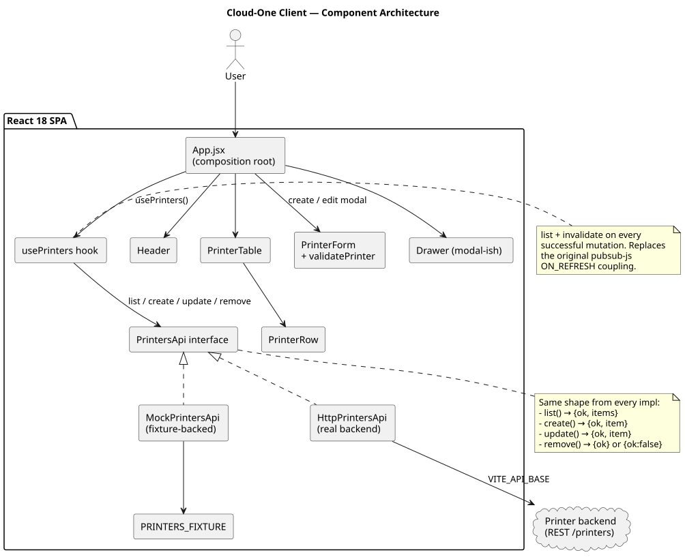
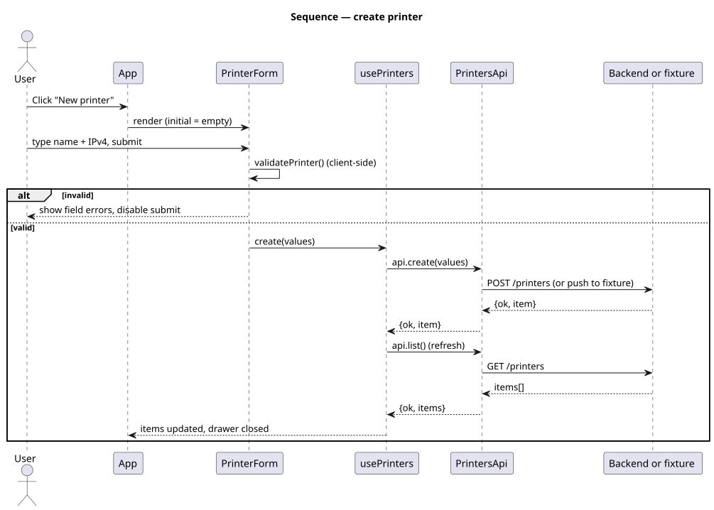
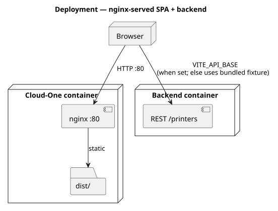

# Cloud-One Client · Printer CRUD

A React 18 SPA for managing printers — list, create, edit, delete — served
behind nginx in a multi-stage Docker image.

[](https://github.com/tzone85/cloudone-client/actions/workflows/ci.yml)


Modernized from the original React 16 / react-scripts 3 / `createReactClass` /
`LinkedStateMixin` / jQuery-modal / pubsub stack. The old app pointed at a
specific EC2 host hardcoded into the form component; the new one reads
`VITE_API_BASE` and defaults to an in-memory mock so the SPA boots offline.

## What changed from the original

| File / area (original)                              | Bug or smell                                                                                  |
|-----------------------------------------------------|-----------------------------------------------------------------------------------------------|
| `source/src/components/CreatePrinter.js`            | `createReactClass` + `LinkedStateMixin` (removed in React 17+).                               |
| `source/src/components/CreatePrinter.js:46`         | `fetch('http://ec2-13-250-127-57.ap-southeast-1.compute.amazonaws.com/printers', …)` — hardcoded production URL inside the component. |
| Modal handling                                      | `data-toggle="modal"` + jQuery to dismiss via `document.getElementById('dismissCreatePrinterForm').click()`. |
| Refresh propagation                                 | `pubsub-js` channel `'ON_REFRESH'` shouted across unrelated components.                       |
| `source/src/components/PrintersList.js`             | Hardcoded sample row, never wired to data.                                                    |
| Validation                                          | None.                                                                                         |
| Tests                                               | Only the CRA boilerplate `App.test.js`.                                                       |

All replaced with: functional components, a `usePrinters` hook that owns the
list + invalidation, a `PrintersApi` interface with mock + http impls (no
hardcoded hosts), Bootstrap 5 (no jQuery), client-side validation, and 24
vitest unit + 2 Playwright e2e tests.

## Architecture

### Components



### Sequence — create printer



### Deployment



Diagrams are PlantUML under `docs/architecture/*.puml`; rendered SVGs are
checked in. Regenerate with `./scripts/render_diagrams.sh`.

## Quick start

```bash
npm install
npm run dev          # vite dev server on :5173 (uses fixture)
npm run build        # produces dist/
npm run preview      # serves dist/ on :4173
npm test             # vitest + coverage (≥80% lines)
npm run test:e2e     # playwright vs preview
npm run lint
```

Point at a real backend:

```bash
VITE_API_BASE=https://api.example npm run dev
```

The backend is expected to provide:

| Method | Path             | Body / response                                                   |
|--------|------------------|-------------------------------------------------------------------|
| GET    | `/printers`      | `[{id, printerName, printerIp, status}]`                          |
| POST   | `/printers`      | body: `{printerName, printerIp, status}` → 200/201 with the item  |
| PUT    | `/printers/{id}` | body: partial patch → 200 with the item                           |
| DELETE | `/printers/{id}` | 204                                                               |

## Container

```bash
docker compose up --build      # nginx serving the SPA on :8080
```

The Dockerfile is multi-stage (`node:20-alpine` for build, `nginx:1.27-alpine`
for runtime); nginx is configured with SPA fallback (`try_files`) and gzip.

## Project layout

```
src/
├── main.jsx                       # entrypoint
├── App.jsx                        # composition root
├── components/
│   ├── Header.jsx
│   ├── PrinterTable.jsx           # loading / error / empty / data
│   ├── PrinterRow.jsx
│   └── PrinterForm.jsx            # create + edit, client-side validation
├── services/
│   ├── printers-api.js            # Mock + Http impls behind one interface
│   ├── use-printers.js            # React hook with list + mutations
│   ├── validate-printer.js        # pure IPv4 + name validator
│   └── …
├── fixtures/printers.js
└── styles/main.css
nginx/default.conf
Dockerfile
docker-compose.yml
.github/workflows/ci.yml
docs/architecture/                 # PlantUML + SVGs
```

## Tests

| Suite                                 | Count   | Notes                                                  |
|---------------------------------------|---------|--------------------------------------------------------|
| `tests/unit/validate-printer.test.js` | 5       | Pure validator: name, IPv4, trim                       |
| `tests/unit/printers-api.test.js`     | 11      | Mock + Http impls; 4xx / 5xx / transport branches      |
| `tests/unit/PrinterForm.test.jsx`     | 4       | Form validation, submit, server-error                  |
| `tests/unit/PrinterTable.test.jsx`    | 4       | Loading / empty / error+retry / rows + actions         |
| `tests/e2e/printers-crud.spec.js`     | 2       | Full create → edit → delete flow + IPv4 rejection      |
| **Total**                             | **26**  | 80% lines / 75% branches gate                          |

## License

MIT — see [LICENSE](LICENSE).
